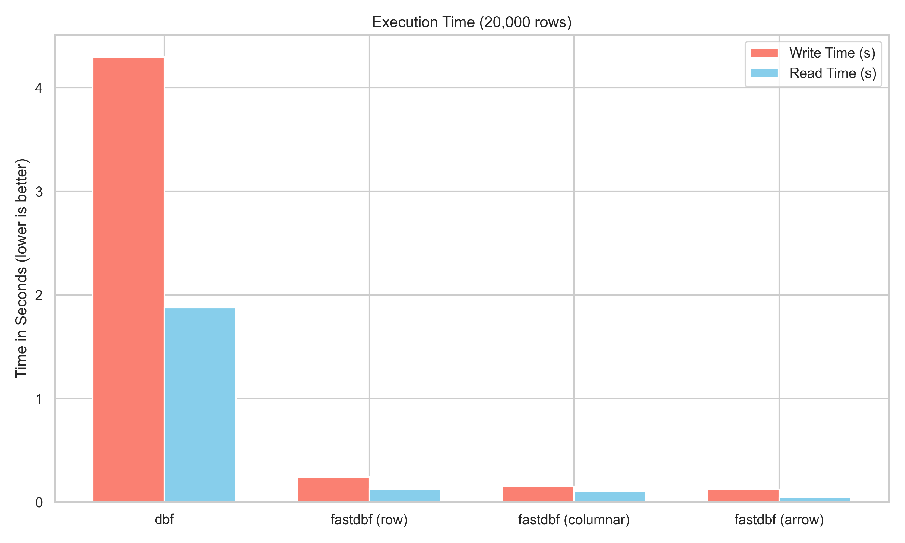
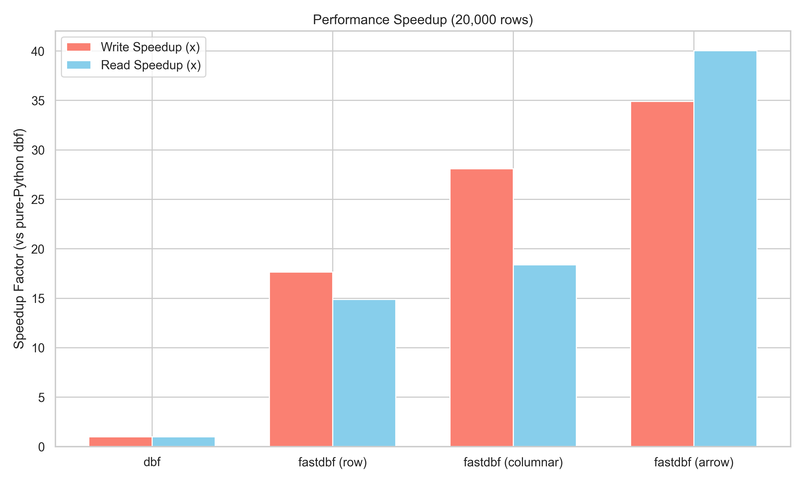

# fastdbf

`fastdbf` is a high-performance Python package for reading and writing `.dbf` files.

Written in **Rust** (using `PyO3`), it provides standard Python bindings designed specifically for **large datasets**, where traditional pure-Python solutions (like the standard `dbf` package) suffer from significant performance bottlenecks.






## Status

`fastdbf` is fully production-ready for core data exchange workloads.

### Supported Features

- **High-Performance I/O**: Lightning fast reads and writes of standard `.dbf` files.
- **Zero-Copy Bulk Transfers**: Native Apache Arrow integration (`to_arrow()`, `extend_arrow()`) for high-speed exchange with Pandas/Polars.
- **Visual FoxPro Support**: Direct handling of VFP `.dbf` flavors, including mandatory null-flag layouts.
- **Memo Fields**: Automatic management of companion `.fpt` memo files for unbounded strings.
- **Strict Typing**: Clear data mappings with custom exception classes (`DbfFormatError`).

### Not Implemented yet

- **In-place Schema Modification**: Dynamic addition/removal of columns on pre-written tables (currently raises `UnsupportedDbfTypeError`).
- **Advanced Engine Tools**: Indexing, cross-table relationships, or built-in query paradigms.


## Installation

Create or sync the development environment with `uv`:

```bash
uv sync
```

Install into the current environment with `uv`:

```bash
uv pip install .
```

Editable install:

```bash
uv pip install -e .
```

Run tests:

```bash
uv run pytest
```

Build a wheel:

```bash
uv build
```

## Quick Start

Read an existing DBF file:

```python
import fastdbf

with fastdbf.Table("people.dbf").open("r") as table:
    print(table.kind)
    print(table.field_names)
    print(table.record_count)
    print(table.row(0))

    for field in table.fields():
        print(field["name"], field["type_code"], field["nullable"])

    for row in table:
        print(row)
```

Create and write a new DBF file:

```python
import fastdbf

specs = "name C(25) null; age N(3,0) null; birth D null; active L null"
with fastdbf.Table("people.dbf", specs, dbf_type="vfp") as table:
    table.append({
        "NAME": "Spunky",
        "AGE": 23,
        "BIRTH": "1989-07-23",
        "ACTIVE": True,
    })

    table.append({
        "NAME": None,
        "AGE": None,
        "BIRTH": None,
        "ACTIVE": None,
    })
```


## Field Types

Currently supported field types:

- `C` Character
- `D` Date
- `L` Logical
- `N` Numeric
- `F` Float
- `I` Integer
- `B` Double
- `T` / `@` DateTime
- `Y` Currency
- `M` / `G` / `P` as reference values

Nullable fields are supported through `null` or `nullable` modifiers in the field specification:

```python
"name C(25) null; amount N(10,2) nullable; created T null"
```

Nullable fields should be used with `dbf_type="vfp"` for Visual FoxPro-compatible null flags.

## pandas Example

```python
import pandas as pd
import fastdbf

with fastdbf.Table("input.dbf").open("r") as table:
    df = pd.DataFrame(list(table))
    df["NAME"] = df["NAME"].str.upper()

    field_specs = []
    for field in table.fields():
        code = field["type_code"]
        nullable = " null" if field["nullable"] else ""
        if code == "C":
            field_specs.append(f'{field["name"]} C({field["length"]}){nullable}')
        elif code in ("N", "F"):
            field_specs.append(
                f'{field["name"]} {code}({field["length"]},{field["decimals"]}){nullable}'
            )
        else:
            field_specs.append(f'{field["name"]} {code}{nullable}')

dbf_type = "vfp" if any(f["nullable"] for f in table.fields()) else "db3"
specs = "; ".join(field_specs)

with fastdbf.Table("output.dbf", specs, dbf_type=dbf_type) as out:
    for row in df.to_dict(orient="records"):
        out.append(row)
```

## Performance & Columnar I/O (Arrow)

For maximum performance, especially with large datasets, `fastdbf` provides columnar read/write interfaces that avoid the high overhead of Python object allocation.

### 1. Apache Arrow Interface (Zero-Copy) — **Fastest**
Leverages the Arrow PyCapsule Interface to exchange data directly between Rust and Pandas / Polars / PyArrow without copying.

**Read into Pandas via Arrow:**
```python
import fastdbf
import pyarrow as pa

with fastdbf.Table("data.dbf").open("r") as table:
    # Arrow Batch -> Pandas DataFrame
    df = pa.Table.from_batches([pa.record_batch(table.to_arrow())]).to_pandas()
```

**Write from Pandas via Arrow:**
```python
import fastdbf
import pyarrow as pa

# Create Arrow batch from DataFrame
batch = pa.RecordBatch.from_pandas(df)

with fastdbf.Table("output.dbf", field_specs="NAME C(20); AGE N(10,2)") as table:
    table.extend_arrow(batch)
```

### 2. Columnar Interface (`to_columns`, `extend_columns`)
Reads/writes data as a dictionary of lists (one list per column). Faster than row-by-row processing but still bound by GIL limits.

**Bulk Columnar Read:**
```python
import pandas as pd
import fastdbf

with fastdbf.Table("data.dbf").open("r") as table:
    cols = table.to_columns()
    df = pd.DataFrame(cols)
```

**Bulk Columnar Write:**
```python
import pandas as pd
import fastdbf

# Assuming df ist das Pandas DataFrame
# Optionale interne Meta-Spalten wie '_deleted' entfernen
clean_data = {col: df[col].tolist() for col in df.columns if col != "_deleted"}

with fastdbf.Table("output.dbf", field_specs="NAME C(20); AGE N(10,2)") as table:
    table.extend_columns(clean_data)
```

---

### Overview: Read/Write Methods compared

| Method | Implementation | Pros |
| :--- | :--- | :--- |
| **Row-by-Row** | `table.row()`, `table.append()` | Easiest to use |
| **Bulk Columnar**| `to_columns()`, `extend_columns()`| No heavy dependencies |
| **Zero-Copy Arrow**| `to_arrow()`, `extend_arrow()` | Direct memory exchange |


## Documentation

Full Python API documentation:

- [docs/PYTHON_API.md](docs/PYTHON_API.md)

Changelog:

- [CHANGELOG.md](CHANGELOG.md)

## Rust Example

```rust
use fastdbf::{Date, Table, Value};

fn main() -> Result<(), Box<dyn std::error::Error>> {
    let mut table = Table::new("name C(25); age N(3,0); birth D; qualified L")?;

    let mut record = table.new_record();
    record.insert(table.fields(), "name", Value::Character("Spunky".into()))?;
    record.insert(table.fields(), "age", Value::Numeric(23.0))?;
    record.insert(table.fields(), "birth", Value::Date(Some(Date::new(1989, 7, 23))))?;
    record.insert(table.fields(), "qualified", Value::Logical(Some(true)))?;
    table.push_record(record)?;

    table.write_to_path("example.dbf")?;
    Ok(())
}
```

## License

This project is licensed under the [Apache License 2.0](LICENSE).
